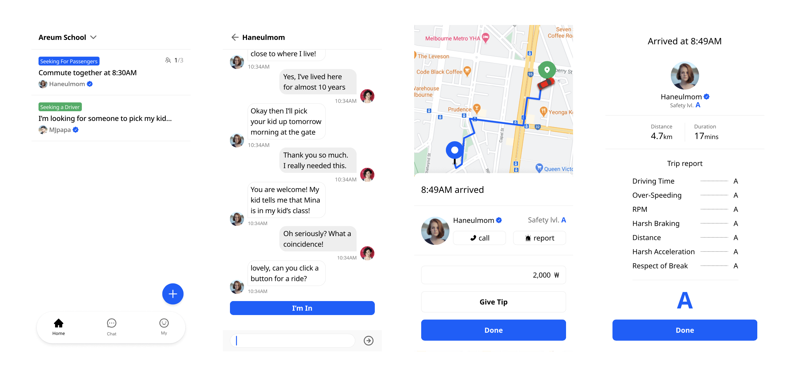

# JunctionX Seoul 2021 Hackathon
AUTOCRYPT Track

# Dino
Reliable carpooling service for the mobility handicapped
## Contributors
- Paul Koo
- Hanbyeol Lee
- Rick Kim
- Jane Shin
- Jungsu Han
- Jongil Seok
## Technologies used

For the development of the mobile-friendly web app, we used:
- React.js
- Vue.js
- Firebase
- Google Maps API
## Presentation

Check on Google Docs(link)

## Future plans

Our future plans are:
- Integrate Autocrypt APIs if provided
- Apply blockchain for the token economy
- Deployment
- Barrier-free design for people with disabilities

